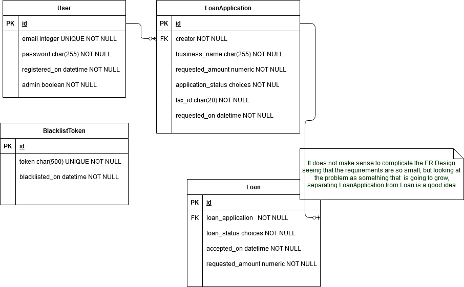

# Oscar Chamat | ldloans project

This repository contains my Test Project, thank you for taking the time to read this documentation.
If you want me to implement some new feature, fix something or give any further detail don't hesitate on reaching me at chamatoscar@gmail.com.

## Easy testing

The easiest way to test is to connect to the server provided in the email and follow [easy-testing.md](easy-testing.md)

## Installation
1) Assuming you have the repository cloned already
2) In linux run `sudo chmod -R 755 ldloans/*`

### Requirements
This is what you need to install in your computer

* `Docker` https://docs.docker.com/install
  — Install Docker for different operating system. See documentation.
* `Docker Compose` https://docs.docker.com/compose/install/
  — Install Docker Compose for macOS, Windows, and Linux
* `cURL` https://develop.zendesk.com/hc/en-us/articles/360001068567-Installing-and-using-cURL#install
  — Install curl

### Putting enviroment file .env

* Some configurations are dependant of the .env file. You need to rename the file [./flask-jwt-auth/.env.bk](./flask-jwt-auth/.env.bk) and the file [./reactjs-jwt-authentication/.env.bk](./reactjs-jwt-authentication/.env.bk)  to .env keeping them in their own respective directory. If you want put the data of your database.
* You need to create the database you specify in the .env file in ./flask-jwt-auth/. Also the same database ended in _test
* You also need to run:
  1) `docker-compose run rest-service python manage.py create_db`
  2) `docker-compose run rest-service python manage.py db init`
  3) `docker-compose run rest-service python manage.py db migrate`

### Testing the api-rest
1) To run the rest service just do -> `docker-compose up -d`

#### Testing the api rest

1) If you want to test in a visual manner here is the url to the project in postman -> https://documenter.getpostman.com/view/7547562/TW6wKUbd
    - You can also see some examples of the urls.
2) In general in the [project](https://documenter.getpostman.com/view/7547562/TW6wKUbd) you can see how to run the rest application with curl

3) You can also review the tests that you run with:
  `docker-compose run rest-service python manage.py test`

#### Testing the React Js frontend
1) To run the react js frontend go to [http://localhost:8080](http://localhost:8080) now you can test according to what it says in [easy-testing.md](easy-testing.md)

## Implementation
I implemented the test project as a union of a Rest Api in Flask and a frontend in Reactjs.

### Implemented Features
* Docker machines with an up to date installation.
* Docker compose files to make easier the use of Docker and the deployment.
* Design of the Database.
* Creation of the Rest Api in Flask with jwt token login.
* Creation of the Rest Api documentaion in postman to simplify testing.
* Creation of the tests of the Res Api in Flask to increase quality and understanding.
* Creation of the Frontend in ReactJS including login with jwt tokens.
* Creation of an nginx production server for the rest-service in Flask to make it more secure and scalable.
* An instalation in AWS is created, configuring the ports, the RDS (database), billing alarms, proper users for the database for easy testing.
* Details; documentation, private variables and methods, custom error messages and providing tool to reduce the complexity of testing.

## Design

### Entity Relationship diagram
* There are different diagrams seeing that the project has different parts; https://drive.google.com/file/d/1N_iRvU32WGnv9p-gp5caOLHz6Ytgwpvb/view?usp=sharing

#### Architecture Diagram

#### JWT Flow of information Sequence Diagram

1) User Registration Phase: – User uses a React.js register form to post user’s info (email, password, is_admin) to Backend API /auth/register. – Backend will check the existing users in database and save user’s signup info to database. Finally, It will return a message (successfully or fail) to

2) User Login Phase: – User posts user/password to login to the Backend RestAPI /auth/login. – Backend will check the username/password, if it is right, Backend will create and JWT string with the configured secret. Then return it to Reactjs client.

After login, user can request secured resources from backend server by adding the JWT token in Authorization Header. For each request, backend will check the JWT signature and then returns back the resources based on user’s registered authorities.

#### ER Diagram

## Extra notes
* Different notes of design provided in the file [minor-notes.md](minor-notes.md)

## Closing
Thanks for reading this far, I wish you a good day and I'm very looking forward to an interview with you.